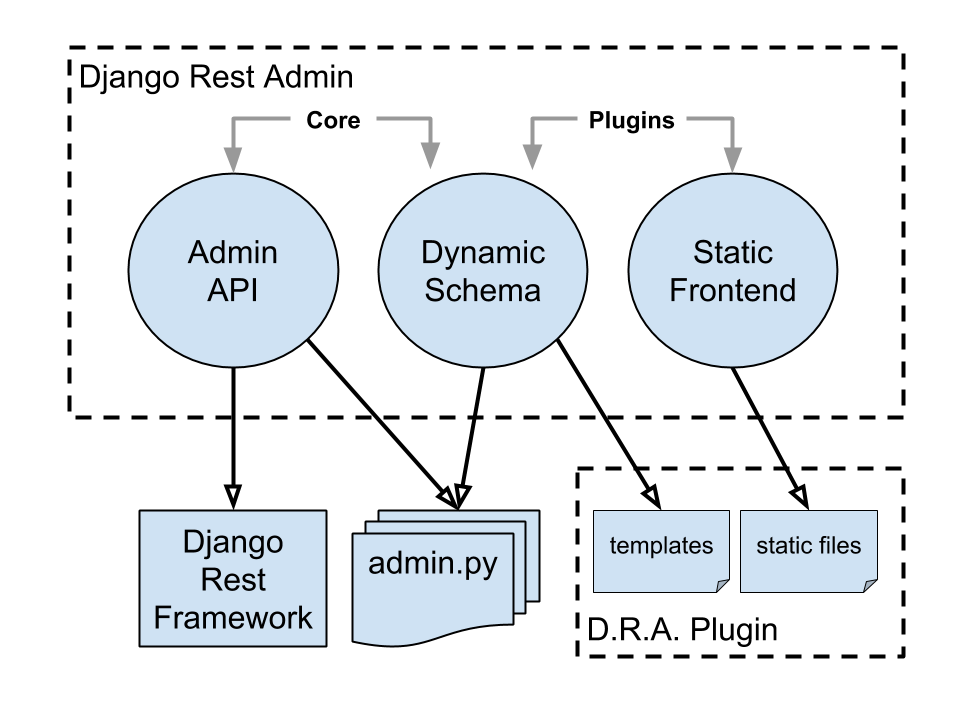

====================================
API-Driven Django Admin Architecture
====================================

There are 3 independent layers forming interface of the system:

* Admin API (on top of `Django Rest Framework <http://www.django-rest-framework.org/>`_)
* Dynamic Schema
* Static front-end

The API layer and the part of Schema implementation responsible for extracting admin structure
are stand-alone. The Static front-end layer and the part of Schema implementation responsible
for rendering the schema are plugin-based.

