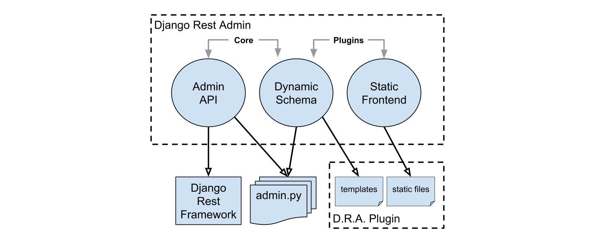

=============
System Design
=============

Overview
--------

There are 3 layers forming interface of the system:

* **API** (REST API on top of `Django Rest Framework <http://www.django-rest-framework.org/>`_)
* **Dynamic Schema** (dynamic part of the frontend generated from Django admin declarations)
* **Static Frontend** (static part of the frontend)

The API layer and part of the Dynamic Schema layer responsible for extracting admin structure
are stand-alone and form core of the system. Static Frontend layer and part of the Schema implementation
responsible for rendering the schema are plugin-based.

Django Rest Admin is designed for maximum reusability. It uses the same declarative
syntax as the built-in Django admin. ``ModelAdmin`` classes are used to generate both API
endpoints and dynamic front-end schema. Plugin-specific templates are used to generate the schema.
The generated dynamic schema is then used by plugin-specific static part to render admin
front-end.

Modules
-------

.. include:: ./modules.rst
